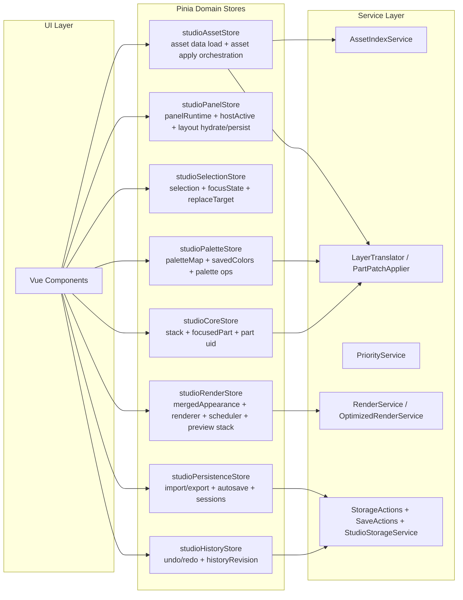

# StudioStore 拆分蓝图

## 目标
- 把 `src/stores/studioStore.js` 从“全域中心”拆为“领域 store + 协调层”。
- 先迁移低耦合 UI 领域，再迁移高风险渲染与核心数据领域。
- 保持现有行为兼容，迁移期间只允许单向收敛，不新增长期桥接债务。

## 现状锚点（基于代码）
- 状态入口在 `src/stores/studioStore.js` 的 state/getters/actions 主体，体量和职责都过大。
- 面板系统逻辑集中在 open/close/toggle/hydrate/persist 一组方法，和业务编辑逻辑耦合。
- 渲染路径同时包含 RenderService 与 OptimizedRenderService，并叠加 render pipeline 开关。
- 历史与存储链路并存：UndoRedo、本地 autosave、多存档、导入导出。
- 资产查询已直接调用 AssetIndexService，但 asset.apply 仍通过 AssetActions。

## 目标领域切分图

## 领域职责边界

### 1) studioCoreStore
- 负责:
  - stacks、selectedIndex、focusedPartIndex、_partUidCounter。
  - 核心 stack CRUD（add/remove/move/select/clear）。
  - 只维护 Part 级真值，不负责 UI 面板、autosave、渲染策略。
- 输入:
  - 来自 selection/asset/palette 的变更命令。
- 输出:
  - 对 render/history 的统一 mutation 事件。

### 2) studioPanelStore
- 负责:
  - panelRuntime、hostActivePanels、panelStates、workspace/mobile tab。
  - openPanel/closePanel/togglePanel、hydrateUiLayout/persistUiLayout。
- 不负责:
  - 任何编辑数据写入、渲染刷新、历史记录。

### 3) studioSelectionStore
- 负责:
  - focusState、selectedLayers、selectionMode、replaceTarget、activeFocusContext。
  - 多选与 replace 模式状态机。
- 不负责:
  - 直接写 stacks 数据。

### 4) studioPaletteStore
- 负责:
  - paletteMap、savedColors、_paletteNextCounter、paletteMode。
  - tag 与颜色映射操作。
- 协作:
  - 通过 command 调用 core 进行 Part 层写入。

### 5) studioRenderStore
- 负责:
  - mergedAppearanceData、preview stack、scheduler、渲染触发。
  - renderer 选择与 render pipeline 编排。
- 不负责:
  - stack 结构修改、存储读写。

### 6) studioHistoryStore
- 负责:
  - UndoRedoManager 生命周期、historyRevision、undo/redo/jump。
- 输入:
  - 来自 core 的 mutation 快照。

### 7) studioPersistenceStore
- 负责:
  - 本地持久化、导入导出、autosave、多存档。
- 不负责:
  - 业务编辑状态机。

### 8) studioAssetStore
- 负责:
  - assetGroupsRaw/assetIndex 加载与查询。
  - asset.apply 的编排（调用 core 写入 + render/history 通知）。

## 迁移顺序（建议执行波次）

### Wave 0: 建立迁移护栏（先做）
- 新增 `src/stores/studio/index.js` 作为组合出口。
- 统一 command 入口，禁止组件直接跨域写对方 state。
- 定义最小契约:
  - core.applyMutation(payload)
  - render.requestRefresh(reason)
  - history.capture(meta)

完成标准:
- 组件层仅使用组合出口，不再直接 import 单体 studioStore。

### Wave 1: 先拆 panel（最低风险）
- 从 `studioStore` 移出:
  - panelRuntime/hostActivePanels/panelStates。
  - open/close/toggle/hydrate/persist panel 相关 action。
- 新建 `src/stores/studio/panelStore.js`。

完成标准:
- 面板行为与现状一致。
- panel 本地持久化键保持兼容。

### Wave 2: 拆 history（低到中风险）
- 移出 UndoRedo 管理与 history panel 显隐逻辑。
- 新建 `src/stores/studio/historyStore.js`。
- 保留旧入口代理一版后删除。

完成标准:
- undo/redo/jump 行为一致。
- historyRevision 仍可驱动 UI 刷新。

### Wave 3: 拆 persistence（中风险）
- 移出 autosave、save/load session、import/export。
- 新建 `src/stores/studio/persistenceStore.js`。
- 统一保存前清洗流程（strip layerEntries）只保留一个实现。

完成标准:
- autosave、手动存档、导入导出端到端可用。

### Wave 4: 拆 selection/focus（中风险）
- 移出 selectedLayers/selectionMode/focusState/replaceTarget。
- 新建 `src/stores/studio/selectionStore.js`。
- 通过 core command 触发数据变更，不直接改 stacks。

完成标准:
- 单选/多选/replace 三条路径行为不变。

### Wave 5: 拆 palette（中到高风险）
- 移出 paletteMap/savedColors/tag 相关操作。
- 新建 `src/stores/studio/paletteStore.js`。
- palette 写路径统一改为 semantic delta 到 core。

完成标准:
- 调色、tag 偏移、批量应用与回退全部可用。

### Wave 6: 拆 render（高风险）
- 新建 `src/stores/studio/renderStore.js`。
- 先搬 preview stack 与 scheduler，再搬 renderer 选择与 pipeline。
- 逐步消除 `useOptimizedRenderer` 双路径依赖，最终单主路径。

完成标准:
- 预览渲染路径稳定。
- 快速路径与全量刷新回退机制行为一致。

### Wave 7: 收口 core + asset（高风险收尾）
- 新建 `src/stores/studio/coreStore.js` 与 `src/stores/studio/assetStore.js`。
- core 保留纯数据写入与选择索引。
- asset 仅保留加载与 apply 编排；删除 `asset-actions` 纯透传函数。

完成标准:
- `studioStore` 退化为薄 facade（或删除）。
- 组件仅依赖领域 store，不再依赖单体 store。

## 迁移期间约束
- 每个 wave 完成后都跑 `npm run build`。
- 每个 wave 只允许一个“主迁移主题”，避免交叉重构。
- 不新增新的 legacy alias；旧接口只做代理并标注删除窗口。
- 对 feature flag 做生命周期标注：保留、固化、删除。

## 回归检查清单
- 面板:
  - context/tool dock/bottom tray/modal 的 panel 切换正确。
- 编辑:
  - stack CRUD、part focus、replace 流程正确。
- 颜色:
  - palette tag、offset、批量应用与撤销正确。
- 渲染:
  - hover preview、layer blink、普通刷新正确。
- 持久化:
  - autosave、session、import/export、恢复流程正确。

## 推荐首个实现 PR
- PR-1 只做 Wave 1（panel store 拆分）。
- PR-2 做 Wave 2（history store）。
- PR-3 做 Wave 3（persistence store）。

这样可以先把 UI 状态与存储从核心编辑链路里剥离，再进入 selection/palette/render 的高风险区域。
